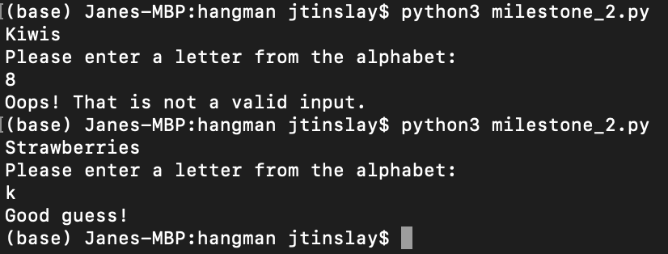
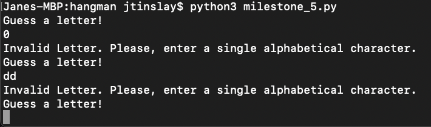
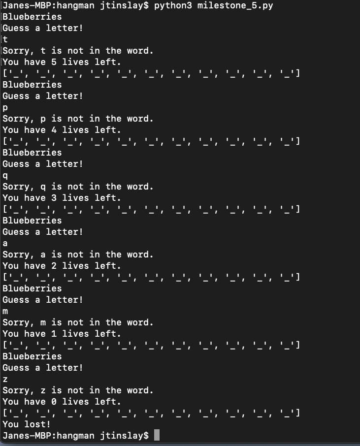
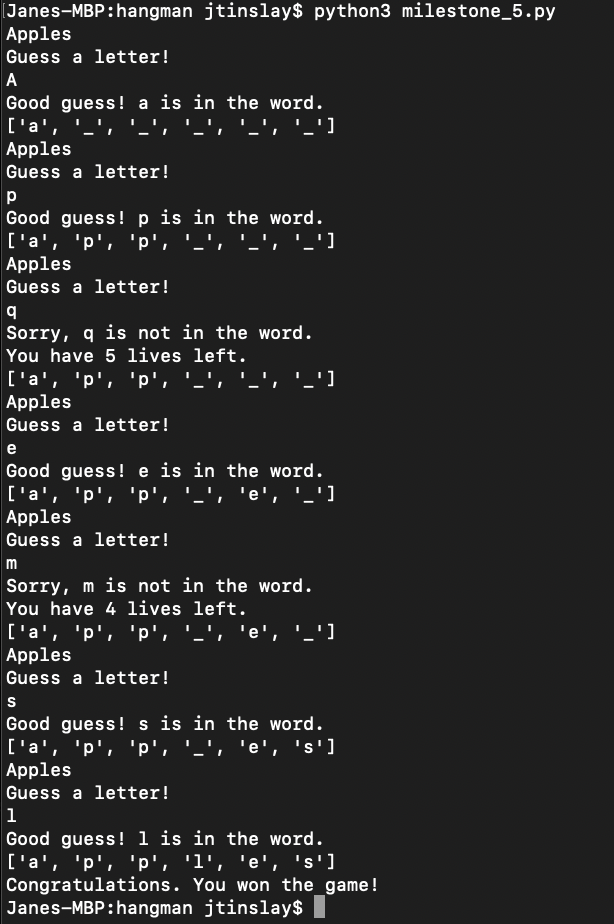
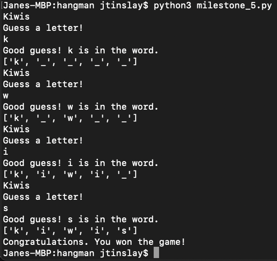

# Hangman

Hangman is a classic game in which a player thinks of a word and the other player tries to guess that word within a certain amount of attempts.

This is a Python implementation of the Hangman game, where the computer thinks of a word and the user tries to guess it. 

## Milestone 1
- The GitHub repository is setup

## Milestone 2
- A list of 5 possible fruits is defined and one is selected at random through the use of the random module as the word for the user to guess.
- The user is then asked to enter a letter. The user input is validated to check if it is a single alphabetic letter. If the user input validation fails, the program exits with an error message. If the user input validation passes, the program exits with a message stating that the user input was valid.

```python
import random

word_list = ["Apples", "Oranges", "Strawberries", "Blueberries", "Kiwis"]

word = random.choice(word_list)

print(word)

print("Please enter a letter from the alphabet:")
guess = input()

if len(guess) == 1 and guess.isalpha():
    print("Good guess!")
else:
    print("Oops! That is not a valid input.")
```

- Output when an invalid letter is input, and then when the program is run again with a valid alphabetical letter as input



## Milestone 3
Two functions, ask_for_input and check_guess are implemented.

Through a while loop, the ask_for_input function continuously runs, waiting for a valid input letter guess from the user. A valid input letter is defined as a single alphabetical letter. After a valid letter is input, the function calls the check_guess function.

The check_guess function checks if the guess is in the chosen word and prints a message telling the user if the guess was correct or not.

The program is run by calling the ask_for_input function.

```python
import random

word_list = ["Apples", "Oranges", "Strawberries", "Blueberries", "Kiwis"]

word = random.choice(word_list).lower()
print(word)

def check_guess(guess):
    if guess.lower() in word:
        print(f"Good guess! {guess} is in the word")
    else:
        print(f"Sorry, {guess} is not in the word. Try again")

def ask_for_input():
    while True:
        print("Type a letter: ")
        guess = input()

        if len(guess) == 1 and guess.isalpha():
            break
        else:
             print("Please, enter a single alphabetical character.")

    check_guess(guess)

ask_for_input()

```

## Milestone 4

The Hangman class is defined. The class is constructed with the following parameters:

- __word_list__:list

    A list of hangman words to randomly select from

- __num_lives__:int
  
    The number of lives the player has at the start of the game. Defaults to 5.


 The class has the following attributes:

- __word_list__:list

    A list of hangman words to randomly select from. Initialised from the __word_list__ attribute.

- __num_lives__:int

    The number of lives the player has at the start of the game, initialised from the __num_lives__ parameter

- __word__:str
   
    A word for the user to play hangman with, randomly selected from the __word_list__ parameter


- __word_guessed__:str

    A list of letters representing each sequential letter in the word. Each element is initially set to "_", and subsequently populated with each correct guess. This is used to visually guide the user as to their progress.

- __num_letters__:int
    
    The number of unique letters in the word that have not be guessed yet


- __list_of_guesses__:list

    The list of guesses that have been tried. Includes both correct and incorrect guesses. 


The following class methods are defined and implemented:

- __check_guess__(_guess_)

    Parameter:
    - _guess_:str. The guessed letter.

     Checks if _guess_ is in the word. 
     
     If the guess is in the word, updates __word_guessed__, replaces each relevant "_" character with the guessed letter and reduces __num_letters__ by one.

     If the guess is not the word, reduces the __num_lives__ by one.

     Prints out relevant messages to the user


- __ask_for_input()__

    Through a while loop, the user inputs a letter guess. If the letter is not a single alphabetical letter or has already been used as a guess, prints out a message asking the user to input a valid letter and repeats until a valid letter is input.

    If the input is a valid letter, calls __check_guess__ with the input as the argument, adds the letter to __list_of_guesses__ and breaks out of the while loop

    
```python
import random

class Hangman:
    def __init__(self, word_list, num_lives = 5):
        self.word_list = word_list
        self.num_lives = num_lives

        self.word = random.choice(word_list)
        self.word_guessed = ["_" for _ in range(len(self.word))]
        self.num_letters = len(set(self.word))
        self.list_of_guesses = []

    def check_guess(self, guess):
        guess = guess.lower()

        if guess in self.word.lower():
            print(f"Good guess! {guess} is in the word.")
            for index, letter in enumerate(self.word.lower()):
                if letter == guess:
                    self.word_guessed[index] = letter

            self.num_letters -= 1

        else:
            self.num_lives -= 1
            print(f"Sorry, {guess} is not in the word.")
            print(f"You have {self.num_lives} lives left.")

    def ask_for_input(self):
        print(self.word)

        while True:
            print("Guess a letter!")
            guess = input()

            if not len(guess) == 1 or not guess.isalpha():
                print("Invalid Letter. Please, enter a single alphabetical character.")

            elif guess in self.list_of_guesses:
                print("You already tried that letter!")

            else:
                self.check_guess(guess)

                self.list_of_guesses.append(guess)
                print(f"{self.num_letters} {self.word_guessed}")

                break


word_list = ["Apples", "Oranges", "Strawberries", "Blueberries", "Kiwis"]

hangman = Hangman(word_list)

hangman.ask_for_input()

```


## Milestone 5

Defines the function:

- __play_game__(_word_list_)

    parameter:
    _word_list_:list 

    Creates an instance of the hangman class as the game object with __word_list__ and a number of lives argument of 6.

    In a while loop, checks if the game object __num_lives__ attribute is zero. If it is, exits the game with a "You lost! statement.

    If the game __num_letters__ is greater than zero, calls the game __ask_for_input__ method.

    If the game __num__lives__ is not zero and all the letters have been found, such that __num_letters__ is not positive, exits with a "Congratulations. You won the game!" message.

Runs the game by defining a word list and calling the play_game function with the word list as an argument.

```python
def play_game(word_list):
    num_lives = 6

    game = Hangman(word_list, num_lives)

    while True:

        if game.num_lives == 0:
            print("You lost!")
            break

        elif game.num_letters > 0:
            game.ask_for_input()
        
        if not game.num_lives == 0 and not game.num_letters > 0:
            print("Congratulations. You won the game!")
            break


word_list = ["Apples", "Oranges", "Strawberries", "Blueberries", "Kiwis"]

play_game(word_list)
 ```

 Gameplay examples with the number of lives set to 6:

 1. Invalid input 


2. No valid guesses


3. Mix of valid and invalid guesses


4. All valid guesses
